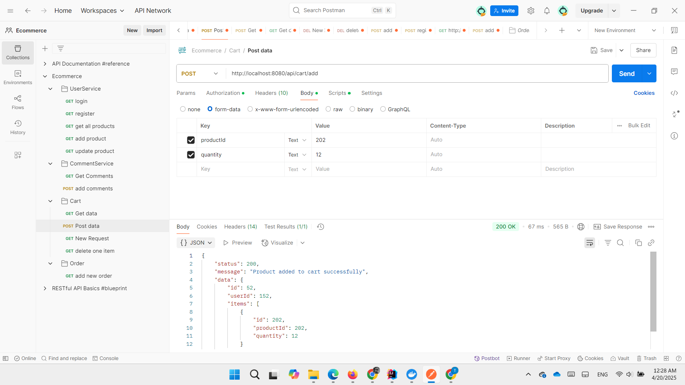

# 🛒 Ecommerce Java Backend

## 📖 Project Overview

This is a Java-based backend for an Ecommerce platform built using **Spring Boot**. The application provides a robust set of APIs to manage users, products, carts, orders, comments, and email notifications. It incorporates **JWT-based authentication**, **role-based access control**, and **transactional operations** to ensure data integrity. The project is designed to support a scalable eCommerce system with features like product management, shopping cart, order processing, and user management.

[**View Project Document**](document/Project_document.pdf)

---

## ✨ Features

- **User Management**: Register, login, email confirmation, password change, and role-based access (USER, ADMIN).
- **Product Management**: Create, update, delete, and retrieve products with image upload support.
- **Cart Management**: Add items to cart, view cart, remove items, and clear cart.
- **Order Processing**: Create orders from cart, update order status, and retrieve order history.
- **Comment System**: Add and retrieve comments for products.
- **Email Notifications**: Send order confirmation and email confirmation codes.
- **JWT Authentication**: Secure APIs with access and refresh tokens.
- **Transactional Operations**: Ensure data consistency with Spring's transactional annotations.
- **Logging**: Comprehensive logging using SLF4J for debugging and monitoring.

---

## 🧰 Technologies Used

- **Java 17**: Core programming language.
- **Spring Boot**: Framework for building RESTful APIs.
- **Spring Data JPA**: For database operations.
- **Spring Security**: For authentication and authorization.
- **JWT (JSON Web Tokens)**: For secure token-based authentication.
- **Lombok**: To reduce boilerplate code.
- **MySQL/PostgreSQL**: Database (configurable).
- **Maven**: Dependency management.
- **JavaMailSender**: For sending emails.
- **SLF4J**: Logging framework.

---

### Some highlights of the project:
**1. Swagger UI for API documentation and testing.**

**2. Email notifications for order confirmations and email verifications.**


**3. Endpoints for user authentication, product management, cart operations, order processing, and comment management.**





## 📁 Project Structure

The backend is organized into services, each handling a specific domain:

- **UserService**: Manages user registration, login, email confirmation, and password changes.
- **ProductService**: Handles product CRUD operations and image uploads.
- **CartService**: Manages shopping cart operations like adding items and clearing the cart.
- **OrderService**: Processes orders, updates order status, and retrieves order details.
- **CommentService**: Manages product comments.
- **EmailService**: Sends email notifications for order confirmations and email verification.
- **JwtService**: Generates and validates JWT tokens for authentication.

---

## ⚙️ Setup Instructions

### ✅ Prerequisites

- Java 17 or higher
- Maven
- MySQL/PostgreSQL database
- SMTP server for email notifications (e.g., Gmail)

---

### 📦 Installation

**Clone the Repository:**
```bash
git clone <repository-url>
cd ecommerce-backend
```

### Configure Database
```bash
spring.datasource.url=jdbc:mysql://localhost:3306/ecommerce
spring.datasource.username=root
spring.datasource.password=your-password
spring.jpa.hibernate.ddl-auto=update
```
### Configure Email
```bash
spring.mail.host=smtp.gmail.com
spring.mail.port=587
spring.mail.username=your-email@gmail.com
spring.mail.password=your-app-password
spring.mail.properties.mail.smtp.auth=true
spring.mail.properties.mail.smtp.starttls.enable=true
```
### Configure JWT Secret
```bash
jwt.secret=your-secret-key
```
